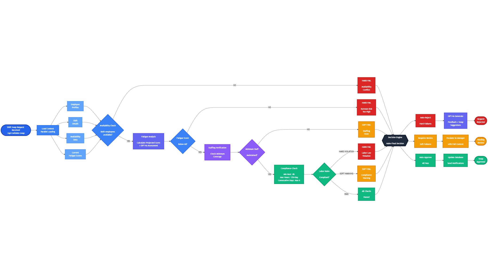

  

## License

This project is licensed under the MIT License - see the [LICENSE](LICENSE) file for details.

  

<!-- project overview -->

> **SmartShift** is an intelligent scheduling and wellness management platform tailored for the healthcare, hospitality, and dynamic shift sectors across the MENA region.
>
> **Problem:** Irregular shift work causes employee burnout, fatigue, and high turnover. Managers lack tools to proactively identify at-risk staff, leading to decreased service quality and increased operational costs.
>
> **Solution:** An AI-powered scheduling system that balances operational needs with employee well-being through:
>
> - **Automated scheduling** with burnout prevention rules.
> - **Real-time fatigue scoring** (0-100 scale with risk levels).
> - **RAG-powered wellness journal** with natural language AI parsing.
> - **Intelligent shift swap validation** using decision-tree logic.
> - **Predictive analytics** for burnout trends and staffing insights.

  

<!-- System Design -->

### System Design

### Entity Relationship Diagram

[ER Diagram](https://dbdiagram.io/d/SmartShift-6950f70939fa3db27ba940fc)

  

<!-- Project Highlights -->

### Interesting Features

> #### 🛡️ Intelligent Shift Swap Agent
> AI-driven validation using decision-tree logic. It evaluates availability and simulates fatigue impact for both parties, auto-approving safe exchanges while blocking those that risk employee burnout.
> 
> #### 🧠 RAG-Powered Wellness Journal
> High-fidelity analysis of employee journals using GPT-4 and Qdrant vector storage. Enables semantic search, allowing managers to query concerns naturally and identify recurring wellness patterns.
> 
> #### 📅  Auto-Scheduler
> Advanced algorithmic generation of weekly schedules that balances operational coverage, availability, and fatigue risks. Managers can review real-time metrics to approve, reject, or fine-tune assignments.
> 

> #### 📉 Real-Time Burnout Prediction
> A holistic fatigue scoring system (Quantitative, Qualitative, Psychological) that updates dynamically. It proactively flags critical cases and prevents high-risk scheduling before exhaustion occurs.

  
<!-- Demo -->

### User Screens

<table>
  <tr>
    <th>Login</th>
    <th>Manager Dashboard</th>
  </tr>
  <tr>
    <td>
      
    </td>
    <td>
      
    </td>
  </tr>
  <tr>
    <th colspan="2">Team Management</th>
  </tr>
  <tr>
    <td colspan="2" align="center">
      
    </td>
  </tr>
</table>

  
<!-- Development & Testing -->

### SmartShift AI Agent

> ####  Autonomous Shift Validation Engine
> An advanced decision-making system powered by **FastAPI** and **LangGraph** that orchestrates a multi-stage evaluation pipeline. Unlike traditional rule engines, the SmartShift Agent leverages **GPT-4o reasoning** to analyze complex factors—including **Availability**, **Projected Fatigue**, **Staffing Levels**, and **Labor Compliance**—ensuring every swap is safe and operationally optimal.

 

### Tests

| CI/CD                             | Testing                        |
| ---------------------------------------  | ------------------------------------- |
|  |  |

  
